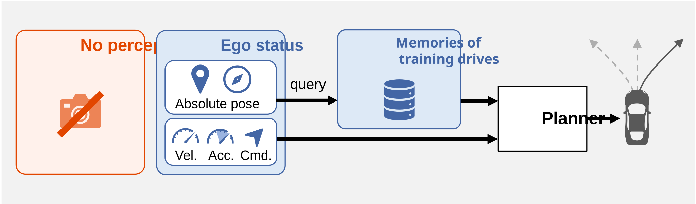
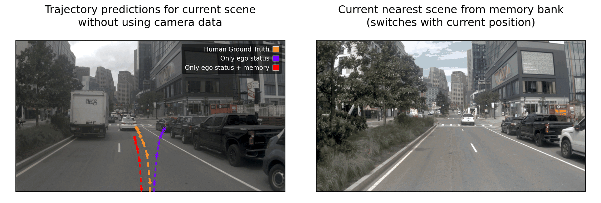

<h1>Driving on Memory</h1>

    <a href="https://scholar.google.com/citations?user=9m868l8AAAAJ"><strong>Christian Löwens</strong></a>
    ·
    <a href="https://scholar.google.com/citations?user=VbjQxioAAAAJ"><strong>Thorben Funke</strong></a>
    ·
    <a href="https://www.inb.uni-luebeck.de/mitarbeiter/mitarbeiter/professoren/alexandru-condurache"><strong>Alexandru Paul Condurache</strong></a>

    <!-- doc badges -->
    

# 
**TL;DR:** We show that high benchmark scores in end-to-end driving can be achieved without observing the current traffic scene, using solely memory from previous drives.

  

## Purpose of the project
We introduce **MemoryDrivoR**, an analytical baseline for assessing whether current autonomous-driving benchmarks genuinely require models to interact with dynamic objects. Using MemoryDrivoR, we critically examine the NAVSIM benchmark and demonstrate that strong performance can be achieved using only static scene information. Although such information is necessary for autonomous driving, it should not be sufficient on its own. Therefore, MemoryDrivoR is intended solely as an auditing and research tool and is not designed for production use.

Here, we present the companion code for our paper "[Driving on Memory](http://arxiv.org/abs/2608.31029)" by Christian Löwens et al. The code allows the users to reproduce and extend the NAVSIM and Bench2Drive results reported in the study. Please cite this work when reporting, reproducing or extending our results. This software is a research prototype, solely developed for and published as part of the paper. It will neither be maintained nor monitored in any way.

## Codebase Usage

This release contains the code. Project-produced **checkpoints and memory banks will be released soon. Until then, the guides explain how to regenerate them from scratch.** Third-party checkpoints that are already public remain linked below.

- `navsim1/` is used for all NAVSIM training and fine-tuning, including the
  NAVSIMv2 models, and for NAVSIMv1 evaluation.
- `navsim2/` is used only for NAVSIMv2 evaluation.
- `bench2drive/` contains the MemoryDrivoR Bench2Drive overlay used for
  training, memory-bank construction, and closed-loop evaluation.

## Quick Reproduction Flow

**NAVSIM:**

1. Create local folders, install environments, and download NAVSIM data and
   external checkpoints with [docs/navsim/setup.md](docs/navsim/setup.md).
2. Regenerate and evaluate NAVSIM artifacts with
   [docs/navsim/reproduction.md](docs/navsim/reproduction.md).
3. Reproduce NAVSIM paper ablations with
   [docs/navsim/ablations.md](docs/navsim/ablations.md).

**Bench2Drive:**

1. Create local folders, install the environment and CARLA, and download
   Bench2Drive data and external checkpoints with
   [docs/bench2drive/setup.md](docs/bench2drive/setup.md).
2. Regenerate and evaluate Bench2Drive artifacts with
   [docs/bench2drive/reproduction.md](docs/bench2drive/reproduction.md).
3. Reproduce Bench2Drive geographic split ablations with
   [docs/bench2drive/ablations.md](docs/bench2drive/ablations.md).

## Artifacts

Large artifacts are not committed to this repository. The local paths below are
the paths expected by the reproduction commands.

### Base DrivoR Checkpoints

| Version | Artifact | Availability | Local path | Size |
| --- | --- | --- | --- | --- |
| NAVSIMv1 | Original DrivoR checkpoint | [Available from DrivoR](https://github.com/valeoai/DrivoR/releases/download/model_weights/drivor_Nav1_25epochs.pth) | `weights/original_ckpts/base_drivor_navsim1.pth` | 291 MB |
| NAVSIMv2 | Original* DrivoR checkpoint | [Available from DrivoR](https://github.com/valeoai/DrivoR/releases/download/model_weights/drivor_Nav2_10epochs.pth) | `weights/original_ckpts/base_drivor_navsim2.pth` | 291 MB |
| NAVSIMv2 | Reproduced* DrivoR checkpoint | Coming soon | `weights/original_ckpts/base_drivor_navsim2.pth` | 291 MB |
| Bench2Drive | Reproduced DrivoR checkpoint | Coming soon | `weights/original_ckpts/base_drivor_b2d.ckpt` | 295.4 MB |

\**Consistent with [reports from others](https://github.com/valeoai/DrivoR/issues/31), we were unable to reproduce the NAVSIMv2 performance reported for DrivoR. To ensure a consistent and fair evaluation, we therefore used our independently reproduced checkpoint in all experiments (incl. memory building and fine-tuning for the models below).*

### MemoryDrivoR And Controls

| Version | Artifact | Availability | Local path | Size |
| --- | --- | --- | --- | --- |
| **NAVSIMv1** | **MemoryDrivoR checkpoint** | Coming soon | `weights/memorydrivor_navsim1.ckpt` | 305.8 MB |
| NAVSIMv1 | Ego-only checkpoint | Coming soon | `weights/ego_only_navsim1.ckpt` | 269.8 MB |
| NAVSIMv1 | HD-map-only checkpoint | Coming soon | `weights/hdmap_only_navsim1.ckpt` | 197.9 MB |
| **NAVSIMv2** | **MemoryDrivoR checkpoint** | Coming soon | `weights/memorydrivor_navsim2.ckpt` | 305.8 MB |
| NAVSIMv2 | Ego-only checkpoint | Coming soon | `weights/ego_only_navsim2.ckpt` | 269.8 MB |
| NAVSIMv2 | HD-map-only checkpoint | Coming soon | `weights/hdmap_only_navsim2.ckpt` | 197.9 MB |
| **Bench2Drive** | **MemoryDrivoR checkpoint** | Coming soon | `weights/memorydrivor_b2d.ckpt` | 310.1 MB |
| Bench2Drive | Ego-only checkpoint | Coming soon | `weights/ego_only_b2d.ckpt` | 273.2 MB |

### Memory Banks

| Version | Artifact | Availability | Local path | Size |
| --- | --- | --- | --- | --- |
| NAVSIMv1 | Memory bank | Coming soon | `memory_banks/memory_bank_navsim1.pt` | 6.3 GB |
| NAVSIMv2 | Memory bank | Coming soon | `memory_banks/memory_bank_navsim2.pt` | 6.3 GB |
| Bench2Drive | Memory bank | Coming soon | `memory_banks/memory_bank_b2d.pt` | 22.2 GB |

The external DINOv2 backbone is downloaded from Hugging Face during setup.

## License

Except where otherwise noted, MemoryDrivoR's original source code and modifications are licensed under AGPL-3.0. See the [LICENSE](LICENSE) file for details.

The documentation asset [`assets/ego_prediction.gif`](assets/ego_prediction.gif) is derived from the nuPlan dataset and is expressly excluded from the AGPL-3.0 license. It is subject to [CC BY-NC-SA 4.0](https://creativecommons.org/licenses/by-nc-sa/4.0/) and the [nuPlan/Motional Dataset Terms](https://www.nuscenes.org/terms-of-use). These asset may be used only for non-commercial purposes.

For a list of third-party software and other licensed materials included in MemoryDrivoR, see [3rd-party-licenses.txt](3rd-party-licenses.txt).
